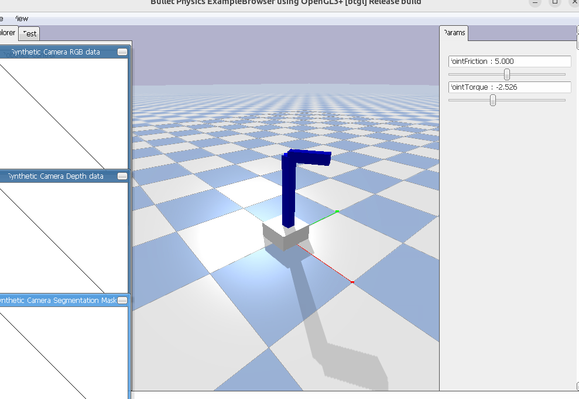

# Ejercicio opcional 1 -> Modelacion y Simulacion de Robots

Irene Diez de Toro - Tercero Ingenieria Robotica de Software

- Generar 3 links: base_link, body_link y top_link
- Hacer que un joint gire sobre el plano z, rotacion paralela al suelo.
- Añadir parametros de friccion y torsion.

Captura en pybullet:

